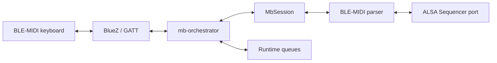
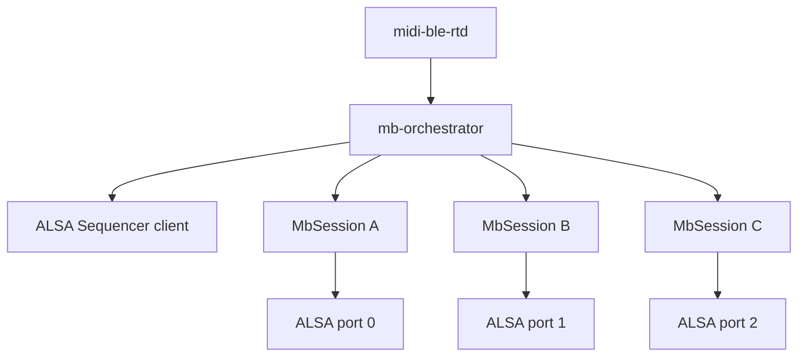
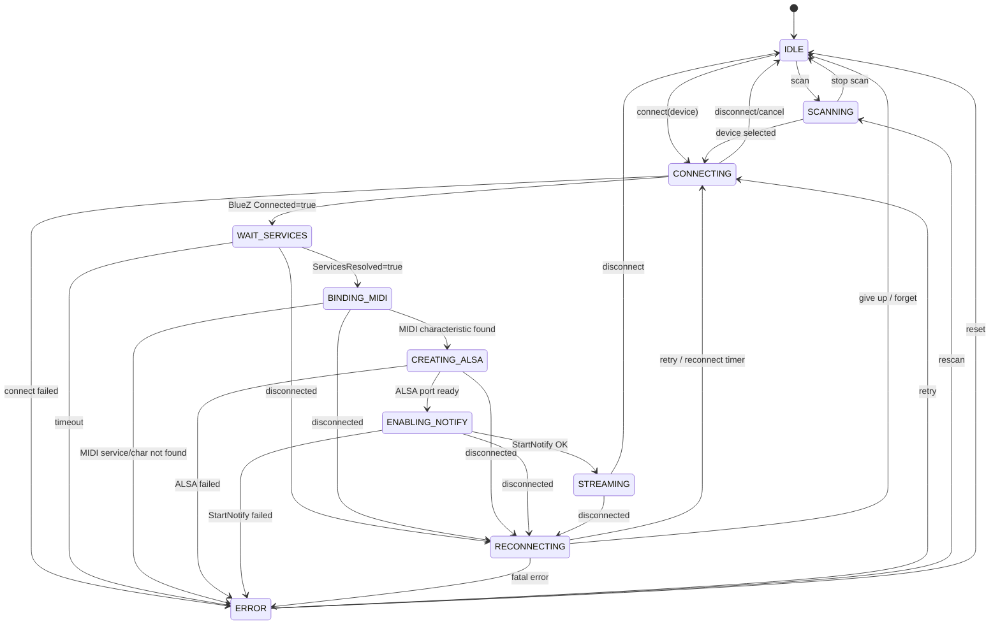

# midi-ble-rt developer README

This document describes the internal architecture of `midi-ble-rt`: state
ownership, MIDI session lifecycle, multi-keyboard identity, and tests.

The user-facing quick start remains in [`README.md`](README.md).  The daemon
layer split is documented in [`docs/ARCHITECTURE.md`](docs/ARCHITECTURE.md).

## Design boundary

`midi-ble-rt` does not duplicate BlueZ's Bluetooth state machine.

BlueZ owns:

```text
Adapter1
Device1
Paired
Trusted
Connected
ServicesResolved
GattService1
GattCharacteristic1
```

`midi-ble-rt` owns:

```text
MbSession
BLE-MIDI characteristic selection
Notify lifecycle decision
BLE-MIDI parser state
ALSA Sequencer port mapping
Runtime queues
Reconnect policy
```

The key rule is:

```text
BlueZ models Bluetooth.
midi-ble-rt models MIDI sessions.
```

## Runtime model

The intended daemon model is:

```text
1 public daemon = midi-ble-rtd
1 daemon = 1 BlueZ adapter context + 1 ALSA Sequencer client + N MIDI sessions
1 BLE-MIDI keyboard = 1 MbSession + 1 parser state + 1 ALSA port
```

A failure in one `MbSession` must not affect any other active session.

Internally, the daemon is split into:

```text
midi-ble-rtd
  -> mb-daemon
      -> mb-orchestrator
          -> core modules / session model / runtime queues
```

The former `midi-ble-rtd-duplex` path was a validation wrapper.  The public
interface should now be a single daemon, while the threaded RX/TX path lives in
`mb-orchestrator`.

## High-level architecture



For multiple keyboards:



## Layer responsibilities

### `mb-daemon`

`mb-daemon` is the process entry layer.  It owns:

```text
main()
argument handling
process startup
exit code
signal/cleanup boundary
```

It should stay small and delegate runtime behavior to `mb-orchestrator`.

### `mb-orchestrator`

`mb-orchestrator` owns runtime policy:

```text
session lifecycle
RX/TX coordination
threaded runtime startup/shutdown
queue push/consume decisions
ALSA polling policy
GATT notification callback policy
reconnect policy, later
multi-session policy, later
```

### Core/session modules

The session object and primitive runtime structures belong to the core:

```text
mb-session
mb-buffer
mb-runtime
mb-duplex-runtime
mb-slice-ring
mb-frame-model
mb-log
```

The next extraction target is to move legacy static helpers from the original
daemon implementation into explicit core modules:

```text
mb-config
mb-bluez
mb-gatt
mb-alsa
mb-ble-midi
```

## Session ownership rule

The session object belongs to the core.  Session lifecycle policy belongs to the
orchestrator.

```text
core:
  what is a session?
  what states and invariants are valid?

orchestrator:
  what should happen to this session now?
  when should it connect, notify, stream, reconnect or stop?
```

This improves debugging:

```text
argument/config failure          -> mb-daemon
state transition/reconnect issue -> mb-orchestrator / mb-session
ALSA event/decode issue          -> mb-alsa
BlueZ/GATT issue                 -> mb-bluez / mb-gatt
BLE-MIDI packet issue            -> mb-ble-midi
queue/drop/overflow issue        -> mb-buffer / mb-runtime
```

## Session states

The session state model is daemon-side MIDI state, not BlueZ internal state.

```text
IDLE
SCANNING
CONNECTING
WAIT_SERVICES
BINDING_MIDI
CREATING_ALSA
ENABLING_NOTIFY
STREAMING
RECONNECTING
ERROR
```

### State diagram



## STREAMING invariant

`Connected=true` is not enough. A session is musically usable only in
`STREAMING`.

For a given `MbSession`, `STREAMING` requires:

```text
BlueZ Device1.Connected=true
BlueZ Device1.ServicesResolved=true
BLE-MIDI characteristic path is bound
Notify is enabled
ALSA port is ready
```

Or, more compactly:

```text
STREAMING = connected + services resolved + MIDI char + notify + ALSA port
```

## Identity model

The stable technical identity is the Bluetooth address:

```text
AA:BB:CC:DD:EE:FF
```

The active runtime key is the BlueZ `device_path`:

```text
/org/bluez/hci0/dev_AA_BB_CC_DD_EE_FF
```

The address is authoritative. If the same address appears again with a different
BlueZ object path, the daemon must reindex the existing `MbSession` instead of
creating a duplicate.

This prevents inconsistent indexes like:

```text
address index -> session A
path index    -> session A and stale session B
```

## Identical keyboards

Two identical Roland GO:KEYS units can expose the same name and the same GATT
shape. That is normal.

Correct model:

```text
GO:KEYS 11:22:33:44:55:66 -> Session A -> ALSA port A
GO:KEYS AA:BB:CC:DD:EE:FF -> Session B -> ALSA port B
```

Name and alias are diagnostics only. They must not be decisive identity.

A user-facing index is acceptable:

```text
gokeys-1 -> 11:22:33:44:55:66
gokeys-2 -> AA:BB:CC:DD:EE:FF
```

But the index is only a label. It must resolve to a stored Bluetooth address.

## GO:KEYS operational rule

For Roland GO:KEYS, connect MIDI/BLE-GATT first and Audio/A2DP later if needed.
If Audio is connected first, MIDI behavior can become unstable or fail.

The daemon must validate the target by GATT service/characteristic, not by BlueZ
`Name` or `Alias`.

## UUID policy

BLE-MIDI service:

```text
03b80e5a-ede8-4b33-a751-6ce34ec4c700
```

Official BLE-MIDI I/O characteristic:

```text
7772e5db-3868-4112-a1a9-f2669d106bf3
```

Roland GO:KEYS alias observed in the lab:

```text
00006bf3-0000-1000-8000-00805f9b34fb
```

The Roland alias is treated as a quirk inside the standard BLE-MIDI service.

## Source layout

Public process entry and orchestrator:

```text
src/mb-daemon.c
src/mb-orchestrator.h
src/mb-orchestrator.c
```

Current legacy daemon core still being extracted:

```text
src/midi-ble-rtd.c
```

Core session/runtime model:

```text
src/mb-session.h
src/mb-session.c
src/mb-buffer.h
src/mb-buffer.c
src/mb-runtime.h
src/mb-runtime.c
src/mb-duplex-runtime.h
src/mb-duplex-runtime.c
src/mb-slice-ring.h
src/mb-slice-ring.c
src/mb-frame-model.h
src/mb-frame-model.c
src/mb-log.h
src/mb-log.c
```

Control plane:

```text
src/midi-ble-rtctl.c
```

Obsolete validation wrapper:

```text
src/midi-ble-rtd-duplex.c
```

`midi-ble-rtd-duplex.c` may remain in the tree temporarily, but it is no longer
the installed daemon model and should not be the target for new functionality.

Tests:

```text
tests/test-mb-session.c
tests/test-mb-buffer.c
tests/test-mb-frame-model.c
tests/test-mb-slice-ring.c
tests/test-mb-runtime.c
tests/test-mb-duplex-runtime.c
```

Supporting docs:

```text
docs/ARCHITECTURE.md
docs/session-state.md
docs/TESTING.md
docs/ALSA.md
docs/SELINUX.md
```

## Session core tests

The GLib unit tests cover:

```text
single-session happy path to STREAMING
BlueZ disconnect -> RECONNECTING
independence between two sessions
identical keyboard names with different addresses
duplicate address reuses/reindexes the same session
error path for missing MIDI characteristic
session removal and index cleanup
invalid transition handling
```

Run:

```bash
cmake -S . -B build -DBUILD_TESTING=ON
cmake --build build
ctest --test-dir build --output-on-failure
```

## Hardware-free tests

Hardware-free tests validate ALSA and MIDI fixtures. They do not validate BlueZ
GATT behavior.

```bash
scripts/test-alsa-loopback.sh
scripts/test-fluidsynth-smoke.sh
```

If the FluidSynth ALSA input port is not auto-detected:

```bash
FLUIDSYNTH_PORT=128:0 scripts/test-fluidsynth-smoke.sh
```

## Runtime refactor direction

The current user workflow remains compatible with:

```bash
midi-ble-rtd --config ~/.config/midi-ble-rt/roland-gokeys.ini
```

The multi-session runtime should evolve toward:

```bash
midi-ble-rtd --config gokeys-1.ini --config gokeys-2.ini
```

with:

```text
1 ALSA client
N ALSA ports
N MbSession instances
N BLE-MIDI parser states
```

The control plane may later grow a user-facing label map:

```text
gokeys-1 = 11:22:33:44:55:66
gokeys-2 = AA:BB:CC:DD:EE:FF
```

The daemon must still resolve labels to addresses before selecting a device.

## Implementation rule of thumb

Keep BlueZ properties as snapshots, not as duplicated state ownership.

Acceptable daemon-owned state:

```text
midi_char_path
notify_enabled
alsa_port_id
parser running status
runtime queue state
reconnect attempts
```

BlueZ-owned state:

```text
Connected
ServicesResolved
Paired
Trusted
GATT object existence
```

The daemon may cache BlueZ values for decision-making, but it must not become the
authority for Bluetooth truth.
