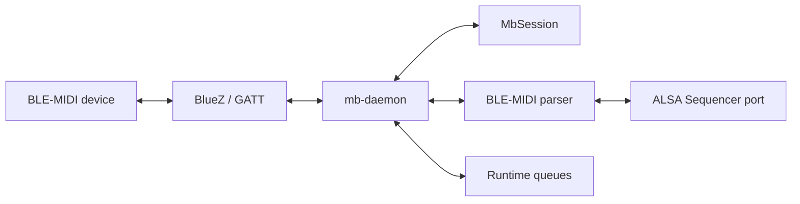
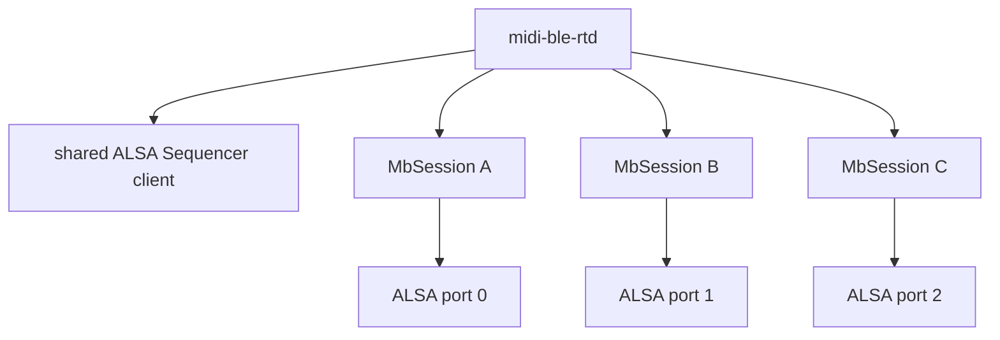
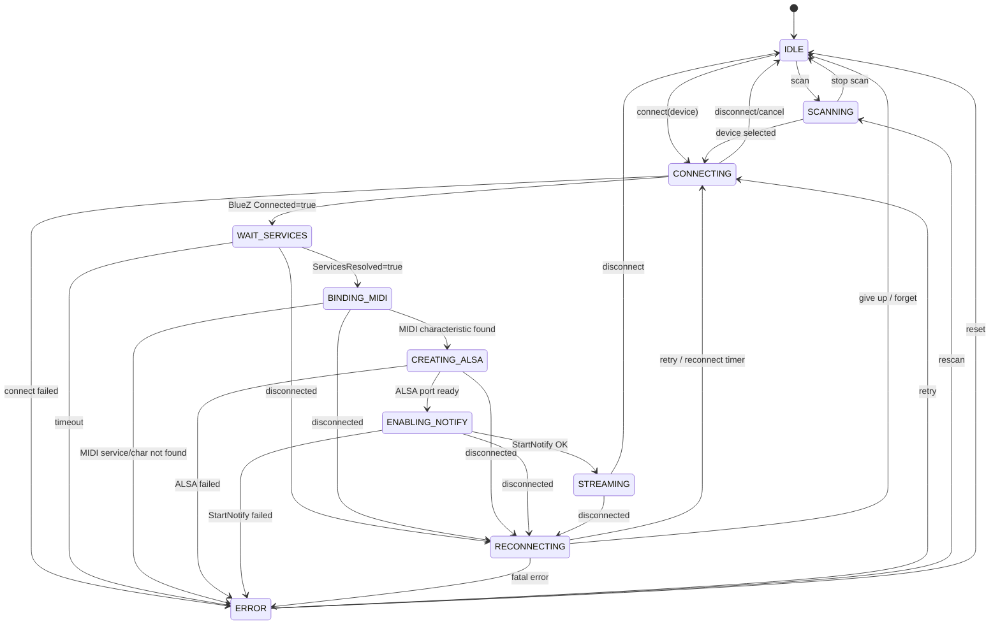

# midi-ble-rt developer README

This document describes the internal architecture of `midi-ble-rt`: state
ownership, MIDI session lifecycle, multi-device identity, runtime queues and
tests.

The user-facing quick start remains in [`README.md`](README.md).  The daemon
layer split is documented in [`docs/ARCHITECTURE.md`](docs/ARCHITECTURE.md), and
the v1.0.0 cleanup state is tracked in
[`docs/CORE_EXTRACTION_STATUS.md`](docs/CORE_EXTRACTION_STATUS.md).

## Design boundary

`midi-ble-rt` does not duplicate BlueZ's Bluetooth state machine.

BlueZ owns:

```text
Adapter1
Device1
Paired
Trusted
Connected
ServicesResolved
GattService1
GattCharacteristic1
```

`midi-ble-rt` owns:

```text
MbSession
BLE-MIDI characteristic selection
Notify lifecycle decision
BLE-MIDI parser state
ALSA Sequencer port mapping
Runtime queues
Reconnect policy
```

The key rule is:

```text
BlueZ models Bluetooth.
midi-ble-rt models MIDI sessions.
```

## Runtime model

The daemon model is:

```text
1 public daemon = midi-ble-rtd
1 daemon = 1 BlueZ adapter context + 1 ALSA Sequencer client + N MIDI sessions
1 BLE-MIDI device = 1 MbSession + 1 parser state + 1 ALSA port
```

A failure in one `MbSession` must not affect any other active session.

## High-level architecture



For multiple devices:



## Layer responsibilities

### `mb-daemon-main.c`

`mb-daemon-main.c` owns process entry concerns:

```text
main()
version handling
argv display name normalization
exit code boundary
```

### `mb-daemon.c`

`mb-daemon.c` owns runtime policy and daemon-owned resources:

```text
config-directory runtime
shared BlueZ bus
shared ALSA Sequencer client
one device runtime per configured BLE-MIDI device
session lifecycle queue
RX/TX coordination
threaded runtime startup/shutdown
queue push/consume decisions
ALSA polling policy
GATT notification callback policy
reconnect policy
control socket
stats export v5
```

### Core/session modules

The session object and primitive runtime structures belong to the core:

```text
mb-session
mb-alsa
mb-alsa-port
mb-bluez
mb-gatt-midi
mb-ble-midi
mb-runtime
mb-duplex-runtime
mb-slice-ring
mb-frame-model
mb-stats
mb-log
mb-paths
mb-rtkit
```

`mb-alsa` owns ALSA Sequencer event classification shared by the daemon and
tests. ALSA Sequencer topology/control events such as `PORT_SUBSCRIBED` and
`PORT_UNSUBSCRIBED` are not MIDI payload and must be rejected before
`snd_midi_event_decode()`.

## Removed legacy code

The v1.0.0 cleanup removed or keeps removed:

```text
src/midi-ble-rtd.c              former monolithic daemon
mb-legacy-core.h                temporary compatibility shim
mb-buffer.[ch]                  unused adaptive buffer prototype
MbSessionBuffers                obsolete per-session buffer field
MbSession.running_status        obsolete parser state field
mb_alsa_port_open_duplex()      single-device ALSA wrapper
mb_alsa_port_close()            single-device ALSA wrapper
mb_stats_export_tsv()           obsolete stats.tsv v4 exporter
test-mb-buffer                  tests for removed buffer prototype
```

Do not reintroduce single-device daemon compatibility paths or hidden inclusion
of implementation `.c` files.

## Session ownership rule

The session object belongs to the core. Session lifecycle policy belongs to the
daemon runtime.

```text
core:
  what is a session?
  what states and invariants are valid?

daemon runtime:
  what should happen to this session now?
  when should it connect, notify, stream, reconnect or stop?
```

This improves debugging:

```text
argument/config failure          -> mb-daemon-main / mb-config
state transition/reconnect issue -> mb-daemon / mb-session
ALSA event/decode issue          -> mb-alsa
BlueZ/GATT issue                 -> mb-bluez / mb-gatt-midi
BLE-MIDI packet issue            -> mb-ble-midi
queue/drop/overflow issue        -> mb-runtime / mb-slice-ring / mb-frame-model
```

## Session states

The session state model is daemon-side MIDI state, not BlueZ internal state.

```text
IDLE
SCANNING
CONNECTING
WAIT_SERVICES
BINDING_MIDI
CREATING_ALSA
ENABLING_NOTIFY
STREAMING
RECONNECTING
ERROR
```

### State diagram



## STREAMING invariant

`Connected=true` is not enough. A session is musically usable only in
`STREAMING`.

For a given `MbSession`, `STREAMING` requires:

```text
BlueZ Device1.Connected=true
BlueZ Device1.ServicesResolved=true
BLE-MIDI characteristic path is bound
Notify is enabled
ALSA port is ready
```

Or, more compactly:

```text
STREAMING = connected + services resolved + MIDI char + notify + ALSA port
```

## Identity model

The stable technical identity is the Bluetooth address:

```text
AA:BB:CC:DD:EE:FF
```

The active runtime key is the BlueZ `device_path`:

```text
/org/bluez/hci0/dev_AA_BB_CC_DD_EE_FF
```

The address is authoritative. If the same address appears again with a different
BlueZ object path, the daemon must reindex the existing `MbSession` instead of
creating a duplicate.

Name and alias are diagnostics only. They must not be decisive identity.

## GO:KEYS operational rule

For Roland GO:KEYS, connect MIDI/BLE-GATT first and Audio/A2DP later if needed.
If Audio is connected first, MIDI behavior can become unstable or fail.

The daemon must validate the target by GATT service/characteristic, not by BlueZ
`Name` or `Alias`.

## UUID policy

BLE-MIDI service:

```text
03b80e5a-ede8-4b33-a751-6ce34ec4c700
```

Official BLE-MIDI I/O characteristic:

```text
7772e5db-3868-4112-a1a9-f2669d106bf3
```

Roland GO:KEYS alias observed in the lab:

```text
00006bf3-0000-1000-8000-00805f9b34fb
```

The Roland alias is treated as a quirk inside the standard BLE-MIDI service.

## Source layout

Daemon executable/runtime:

```text
src/mb-daemon-main.c
src/mb-daemon.c
```

Core session/runtime model:

```text
src/mb-session.h
src/mb-session.c
src/mb-alsa.h
src/mb-alsa.c
src/mb-alsa-port.h
src/mb-alsa-port.c
src/mb-bluez.h
src/mb-bluez.c
src/mb-gatt-midi.h
src/mb-gatt-midi.c
src/mb-ble-midi.h
src/mb-ble-midi.c
src/mb-runtime.h
src/mb-runtime.c
src/mb-duplex-runtime.h
src/mb-duplex-runtime.c
src/mb-slice-ring.h
src/mb-slice-ring.c
src/mb-frame-model.h
src/mb-frame-model.c
src/mb-stats.h
src/mb-stats.c
src/mb-log.h
src/mb-log.c
src/mb-paths.h
src/mb-paths.c
```

Control plane:

```text
src/mb-ctl-main.c
src/mb-stats-ctl.c
src/midi-ble-rtctl.c
```

Tests:

```text
tests/test-mb-session.c
tests/test-mb-session-state.c
tests/test-mb-alsa.c
tests/test-mb-ble-midi.c
tests/test-mb-config.c
tests/test-mb-frame-model.c
tests/test-mb-slice-ring.c
tests/test-mb-runtime.c
tests/test-mb-duplex-runtime.c
tests/test-mb-paths.c
tests/test-mb-control-protocol.c
```

## Session core tests

The GLib unit tests cover:

```text
single-session happy path to STREAMING
BlueZ disconnect -> RECONNECTING
independence between two sessions
identical device names with different addresses
duplicate address reuses/reindexes the same session
error path for missing MIDI characteristic
session removal and index cleanup
invalid transition handling
ALSA MIDI payload versus control event classification
```

Run:

```bash
cmake -S . -B build -DBUILD_TESTING=ON
cmake --build build
ctest --test-dir build --output-on-failure
```

## Hardware-free tests

Hardware-free tests validate ALSA and MIDI fixtures. They do not validate BlueZ
GATT behavior.

```bash
scripts/test-alsa-loopback.sh
scripts/test-fluidsynth-smoke.sh
```

If the FluidSynth ALSA input port is not auto-detected:

```bash
FLUIDSYNTH_PORT=128:0 scripts/test-fluidsynth-smoke.sh
```

## Validation before v1.0.0

Before merging this cleanup to `master` and tagging v1.0.0:

```bash
cmake -S . -B build -DCMAKE_BUILD_TYPE=RelWithDebInfo
cmake --build build
ctest --test-dir build --output-on-failure
```

Then run the physical GO:KEYS smoke test:

```text
start daemon
confirm STREAMING
confirm ALSA client:port
send TX via aplaymidi
receive RX via aseqdump
power-cycle device
confirm RECONNECTING -> STREAMING
```
