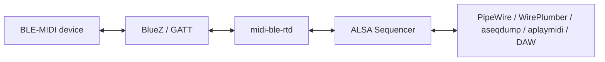

# midi-ble-rt

`midi-ble-rt` is Linux BLE-MIDI infrastructure.

It exposes Bluetooth LE MIDI devices as stable ALSA Sequencer MIDI ports that
standard Linux MIDI tools, DAWs, PipeWire and WirePlumber-based desktops can
consume.

It uses BlueZ as the BLE/GATT transport, finds the BLE-MIDI service and I/O
characteristic directly, subscribes to notifications, decodes BLE-MIDI packets,
publishes ALSA Sequencer ports, and can write short MIDI messages back through
GATT `WriteValue`.

The core BLE-MIDI data path does not depend on PipeWire. PipeWire is expected to
consume the ALSA MIDI ports exported by this daemon.

The first validated hardware target is the Roland GO:KEYS family, but the
project target is any usable BLE-MIDI instrument, controller, module or adapter.

For a generic device tutorial using the standard BLE-MIDI configuration, see
[`docs/GENERIC_BLE_MIDI_DEVICE.md`](docs/GENERIC_BLE_MIDI_DEVICE.md). For
developer architecture notes, state diagrams, multi-device identity rules and
test internals, see [`DEVELOPERS.md`](DEVELOPERS.md). For the daemon layer split,
see [`docs/ARCHITECTURE.md`](docs/ARCHITECTURE.md). For timeout, reconnect and
session telemetry behavior, see [`docs/SESSION_RESILIENCE.md`](docs/SESSION_RESILIENCE.md).

## Architecture overview

External data path:

```text
BLE-MIDI device <-> BlueZ/GATT <-> midi-ble-rtd <-> ALSA Sequencer <-> PipeWire/apps
```



Internal daemon structure:

```text
midi-ble-rtd
  -> mb-daemon
      -> mb-orchestrator
          -> core modules / session model / runtime queues
```

There is one public daemon binary: `midi-ble-rtd`. The previous
`midi-ble-rtd-duplex` validation path has been absorbed into the daemon's
internal orchestrator layer and is no longer a separate installed daemon target.

The primary exported interface is ALSA Sequencer. PipeWire, JACK bridges, DAWs
and standard MIDI tools may consume or display those ALSA MIDI ports, but they
are not dependencies of the core BLE-MIDI bridge.

## Current status

Validated receive path:

```text
Roland GO:KEYS MIDI
-> BLE/GATT
-> service 03b80e5a-ede8-4b33-a751-6ce34ec4c700
-> characteristic 00006bf3-0000-1000-8000-00805f9b34fb
-> StartNotify
-> midi-ble-rtd orchestrator
-> ALSA Sequencer
-> aseqdump / DAW / PipeWire environment
```

Validated transmit path:

```text
aplaymidi / DAW / ALSA Sequencer client
-> midi-ble-rtd orchestrated ALSA port
-> runtime TX queue
-> BLE-MIDI packet encoder
-> GATT WriteValue
-> Roland GO:KEYS
```

Observed ALSA events:

```text
Note on   ch 0, note 96, velocity 26
Note off  ch 0, note 96, velocity 64
```

ALSA Sequencer control events such as `PORT_SUBSCRIBED` and
`PORT_UNSUBSCRIBED` are ignored before MIDI decode. They are not MIDI payload.

## BLE-MIDI UUIDs

Standard BLE-MIDI service:

```text
03b80e5a-ede8-4b33-a751-6ce34ec4c700
```

Standard BLE-MIDI I/O characteristic:

```text
7772e5db-3868-4112-a1a9-f2669d106bf3
```

Roland GO:KEYS I/O alias observed in the lab:

```text
00006bf3-0000-1000-8000-00805f9b34fb
```

`midi-ble-rt` treats the Roland UUID as a device quirk inside the standard
BLE-MIDI service.

## Install on Fedora from COPR

Fedora packages are published through the `mwprado/cangaceiro` COPR repository:

```text
https://copr.fedorainfracloud.org/coprs/mwprado/cangaceiro/
```

On a regular Fedora system:

```bash
sudo dnf install 'dnf-command(copr)'
sudo dnf copr enable mwprado/cangaceiro
sudo dnf install midi-ble-rt
```

On Fedora Atomic / rpm-ostree based systems, enable the COPR repository file and
layer the package:

```bash
fedora_version=$(rpm -E %fedora)
sudo curl -L -o /etc/yum.repos.d/_copr_mwprado-cangaceiro.repo \
  "https://copr.fedorainfracloud.org/coprs/mwprado/cangaceiro/repo/fedora-${fedora_version}/mwprado-cangaceiro-fedora-${fedora_version}.repo"
sudo rpm-ostree install midi-ble-rt
systemctl reboot
```

After installation, the installed commands are:

```text
midi-ble-rtd
midi-ble-rtctl
```

Installed example configs are under:

```text
/usr/share/midi-ble-rt/config/
```

## Packaging TODO

Ubuntu/Debian packaging is planned but not published yet. The intended next
package target is a `.deb` package with Debian metadata under `debian/`, so the
project can be installed on Ubuntu without building manually from source.

## Build on Fedora

```bash
sudo dnf install gcc cmake glib2-devel alsa-lib-devel bluez bluez-tools alsa-utils
cmake -S . -B build
cmake --build build
```

The public build targets are:

```text
midi-ble-rtd
midi-ble-rtctl
```

## Control CLI

`midi-ble-rtctl` is the BlueZ control-plane tool. It discovers, inspects,
prepares and configures BLE-MIDI devices without manually driving `bluetoothctl`
for every step.

Help:

```bash
midi-ble-rtctl --help
midi-ble-rtctl help connect
midi-ble-rtctl help configure
```

Inspect devices:

```bash
midi-ble-rtctl list
midi-ble-rtctl list --midi-only
midi-ble-rtctl scan --timeout 10 --midi-only
midi-ble-rtctl info CB:81:F4:62:FF:07
midi-ble-rtctl probe CB:81:F4:62:FF:07
```

## Generic BLE-MIDI config

Use the generic config first when testing an unknown standards-compliant
BLE-MIDI instrument, controller, module or adapter:

```text
config/standard-ble-midi.ini.example
```

For a complete generic device tutorial, see:

```text
docs/GENERIC_BLE_MIDI_DEVICE.md
```

Copy it to your user config directory and replace the address:

```bash
mkdir -p ~/.config/midi-ble-rt
cp /usr/share/midi-ble-rt/config/standard-ble-midi.ini.example \
   ~/.config/midi-ble-rt/standard-ble-midi.ini
$EDITOR ~/.config/midi-ble-rt/standard-ble-midi.ini
```

For a local build tree, copy from the repository instead:

```bash
cp config/standard-ble-midi.ini.example \
   ~/.config/midi-ble-rt/standard-ble-midi.ini
```

Then run:

```bash
midi-ble-rtd --config ~/.config/midi-ble-rt/standard-ble-midi.ini
```

The generic config uses only:

```text
service_uuid = 03b80e5a-ede8-4b33-a751-6ce34ec4c700
io_uuid      = 7772e5db-3868-4112-a1a9-f2669d106bf3
```

It intentionally leaves vendor-specific aliases empty.

## Roland GO:KEYS config

Prepare a Roland GO:KEYS:

```bash
midi-ble-rtctl pair CB:81:F4:62:FF:07
midi-ble-rtctl trust CB:81:F4:62:FF:07
midi-ble-rtctl connect CB:81:F4:62:FF:07 --profile roland_gokeys
midi-ble-rtctl configure CB:81:F4:62:FF:07 --profile roland_gokeys --force
```

Or combine connect and config writing:

```bash
midi-ble-rtctl connect CB:81:F4:62:FF:07 --profile roland_gokeys --write-config
```

Default GO:KEYS config path:

```text
~/.config/midi-ble-rt/roland-gokeys.ini
```

## Run data plane

For a generic BLE-MIDI device:

```bash
midi-ble-rtd --config ~/.config/midi-ble-rt/standard-ble-midi.ini
```

For a Roland GO:KEYS device-specific config:

```bash
midi-ble-rtd --config ~/.config/midi-ble-rt/roland-gokeys.ini
```

Expected startup marker:

```text
midi-ble-rtd
Runtime: orchestrator
```

Check the ALSA port:

```bash
aconnect -l
aseqdump -p CLIENT:PORT
```

Use the numeric `CLIENT:PORT` shown by `aconnect -l`, for example `128:0`.

## Auto reconnect and session timings

By default, the example configs enable:

```ini
[device]
auto_reconnect = yes
```

With auto reconnect enabled, connection failures and recoverable BlueZ/GATT
failures move the daemon to `RECONNECTING` instead of exiting. The daemon then
tries to reconnect every 10 seconds. Current operational timeouts are documented
in [`docs/SESSION_RESILIENCE.md`](docs/SESSION_RESILIENCE.md): `Device1.Connect()`
uses 30 seconds, `ServicesResolved` uses 15 seconds, `StartNotify` uses 15 seconds,
`WriteValue` uses 5 seconds, and the device health check runs every 1 second.

The stats file should reflect the session state immediately after transitions:

```text
/run/user/$UID/midi-ble-rt/stats.tsv
```

Expected states during recovery are `CONNECTING`, `RECONNECTING` and then
`STREAMING` after the device becomes available again.

## Receive MIDI

```bash
aseqdump -p 128:0
```

or record a MIDI file:

```bash
arecordmidi -p 128:0 generic-input.mid
```

## Send MIDI

The daemon creates an orchestrated duplex ALSA Sequencer port. After the daemon
is running, send a MIDI file into the same `CLIENT:PORT`:

```bash
aplaymidi -p 128:0 test.mid
```

For a minimal smoke test, use the repository test MIDI file:

```bash
aplaymidi -p 128:0 examples/midi/test-note.mid
```

Transmit can be disabled in the config:

```ini
[midi]
enable_tx = no
```

## Multiple devices

The session core is designed for:

```text
1 daemon = 1 ALSA client + N MIDI sessions + N ALSA ports
```

For identical devices, such as two equal controllers or two GO:KEYS units, do not
rely on name or alias. Use Bluetooth addresses:

```text
device-1 -> 11:22:33:44:55:66
device-2 -> AA:BB:CC:DD:EE:FF
```

The label is human-facing. The address is the technical identity.

## Operational rule for Roland GO:KEYS

Connect MIDI first, then Audio/A2DP if needed.

When the GO:KEYS is connected as Audio, it behaves as a Bluetooth speaker or
receiver. That is not the MIDI path. The daemon validates the MIDI target by GATT,
not by BlueZ `Name` or `Alias`.

If transmit works but receive is silent after reconnects, see
[`docs/ROLAND_GOKEYS_RECOVERY.md`](docs/ROLAND_GOKEYS_RECOVERY.md).

## Hardware-free tests

Hardware-free tests are documented in:

```text
docs/TESTING.md
```

Validate ALSA MIDI write/read without a BLE-MIDI device:

```bash
scripts/test-alsa-loopback.sh
```

Validate the example MIDI file through FluidSynth without a BLE-MIDI device:

```bash
scripts/test-fluidsynth-smoke.sh
```

The FluidSynth test requires an existing FluidSynth ALSA Sequencer input port. If
the port is not auto-detected:

```bash
FLUIDSYNTH_PORT=128:0 scripts/test-fluidsynth-smoke.sh
```

These tests validate ALSA and MIDI fixtures. They do not validate BlueZ GATT
behavior.

## SELinux

SELinux can block the ALSA Sequencer side of the integration. Do not solve this by
globally disabling SELinux. See:

```text
docs/SELINUX.md
selinux/bluez_midi_alsa.te.example
scripts/selinux-diagnose.sh
```
