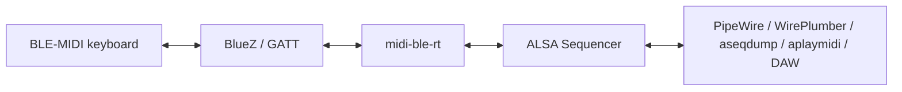

# midi-ble-rt

`midi-ble-rt` is Linux BLE-MIDI infrastructure.

It exposes Bluetooth LE MIDI devices as stable ALSA Sequencer MIDI ports that
standard Linux MIDI tools, DAWs, PipeWire and WirePlumber-based desktops can
consume.

It uses BlueZ as the BLE/GATT transport, finds the BLE-MIDI service and I/O
characteristic directly, subscribes to notifications, decodes BLE-MIDI packets,
publishes ALSA Sequencer ports, and can write short MIDI messages back through
GATT `WriteValue`.

The core BLE-MIDI data path does not depend on PipeWire. PipeWire is expected to
consume the ALSA MIDI ports exported by this daemon.

The first validated target is the Roland GO:KEYS family.

For developer architecture notes, state diagrams, multi-keyboard identity rules
and test internals, see [`DEVELOPERS.md`](DEVELOPERS.md).

## Architecture overview

```text
BLE-MIDI device <-> BlueZ/GATT <-> midi-ble-rt <-> ALSA Sequencer <-> PipeWire/apps
```



The primary exported interface is ALSA Sequencer. PipeWire, JACK bridges, DAWs
and standard MIDI tools may consume or display those ALSA MIDI ports, but they
are not dependencies of the core BLE-MIDI bridge.

## Current status

Validated receive path:

```text
Roland GO:KEYS MIDI
-> BLE/GATT
-> service 03b80e5a-ede8-4b33-a751-6ce34ec4c700
-> characteristic 00006bf3-0000-1000-8000-00805f9b34fb
-> StartNotify
-> midi-ble-rtd
-> ALSA Sequencer
-> aseqdump / DAW / PipeWire environment
```

Initial transmit path:

```text
aplaymidi / DAW / ALSA Sequencer client
-> midi-ble-rtd duplex ALSA port
-> BLE-MIDI packet encoder
-> GATT WriteValue
-> Roland GO:KEYS
```

Observed ALSA events:

```text
Note on   ch 0, note 96, velocity 26
Note off  ch 0, note 96, velocity 64
```

## BLE-MIDI UUIDs

Standard BLE-MIDI service:

```text
03b80e5a-ede8-4b33-a751-6ce34ec4c700
```

Standard BLE-MIDI I/O characteristic:

```text
7772e5db-3868-4112-a1a9-f2669d106bf3
```

Roland GO:KEYS I/O alias observed in the lab:

```text
00006bf3-0000-1000-8000-00805f9b34fb
```

`midi-ble-rt` treats the Roland UUID as a device quirk inside the standard
BLE-MIDI service.

## Build on Fedora

```bash
sudo dnf install gcc cmake glib2-devel alsa-lib-devel bluez bluez-tools alsa-utils
cmake -S . -B build
cmake --build build
```

## Control CLI

`midi-ble-rtctl` is the BlueZ control-plane tool. It discovers, inspects,
prepares and configures BLE-MIDI devices without manually driving `bluetoothctl`
for every step.

Help:

```bash
midi-ble-rtctl --help
midi-ble-rtctl help connect
midi-ble-rtctl help configure
```

Inspect devices:

```bash
midi-ble-rtctl list
midi-ble-rtctl list --midi-only
midi-ble-rtctl scan --timeout 10 --midi-only
midi-ble-rtctl info CB:81:F4:62:FF:07
midi-ble-rtctl probe CB:81:F4:62:FF:07
```

## Generic BLE-MIDI config

Use the generic config first when testing an unknown standards-compliant
BLE-MIDI keyboard:

```text
config/standard-ble-midi.ini.example
```

Copy it to your user config directory and replace the address:

```bash
mkdir -p ~/.config/midi-ble-rt
cp /usr/share/midi-ble-rt/config/standard-ble-midi.ini.example \
   ~/.config/midi-ble-rt/standard-ble-midi.ini
$EDITOR ~/.config/midi-ble-rt/standard-ble-midi.ini
```

For a local build tree, copy from the repository instead:

```bash
cp config/standard-ble-midi.ini.example \
   ~/.config/midi-ble-rt/standard-ble-midi.ini
```

Then run:

```bash
midi-ble-rtd --config ~/.config/midi-ble-rt/standard-ble-midi.ini
```

The generic config uses only:

```text
service_uuid = 03b80e5a-ede8-4b33-a751-6ce34ec4c700
io_uuid      = 7772e5db-3868-4112-a1a9-f2669d106bf3
```

It intentionally leaves vendor-specific aliases empty.

## Roland GO:KEYS config

Prepare a Roland GO:KEYS:

```bash
midi-ble-rtctl pair CB:81:F4:62:FF:07
midi-ble-rtctl trust CB:81:F4:62:FF:07
midi-ble-rtctl connect CB:81:F4:62:FF:07 --profile roland_gokeys
midi-ble-rtctl configure CB:81:F4:62:FF:07 --profile roland_gokeys --force
```

Or combine connect and config writing:

```bash
midi-ble-rtctl connect CB:81:F4:62:FF:07 --profile roland_gokeys --write-config
```

Default GO:KEYS config path:

```text
~/.config/midi-ble-rt/roland-gokeys.ini
```

## Run data plane

```bash
midi-ble-rtd --config ~/.config/midi-ble-rt/roland-gokeys.ini
```

Check the ALSA port:

```bash
aconnect -l
aseqdump -p CLIENT:PORT
```

Use the numeric `CLIENT:PORT` shown by `aconnect -l`, for example `128:0`.

## Receive MIDI

```bash
aseqdump -p 128:0
```

or record a MIDI file:

```bash
arecordmidi -p 128:0 gokeys-input.mid
```

## Send MIDI

The daemon creates a duplex ALSA Sequencer port. After the daemon is running,
send a MIDI file into the same `CLIENT:PORT`:

```bash
aplaymidi -p 128:0 test.mid
```

For a minimal smoke test, use the repository test MIDI file:

```bash
aplaymidi -p 128:0 examples/midi/test-note.mid
```

Transmit can be disabled in the config:

```ini
[midi]
enable_tx = no
```

## Multiple keyboards

The session core is designed for:

```text
1 daemon = 1 ALSA client + N MIDI sessions + N ALSA ports
```

For identical keyboards, such as two GO:KEYS units, do not rely on name or alias.
Use Bluetooth addresses:

```text
gokeys-1 -> 11:22:33:44:55:66
gokeys-2 -> AA:BB:CC:DD:EE:FF
```

The label is human-facing. The address is the technical identity.

## Operational rule for Roland GO:KEYS

Connect MIDI first, then Audio/A2DP if needed.

When the GO:KEYS is connected as Audio, it behaves as a Bluetooth speaker or
receiver. That is not the MIDI path. The daemon validates the MIDI target by GATT,
not by BlueZ `Name` or `Alias`.

If transmit works but receive is silent after reconnects, see
[`docs/ROLAND_GOKEYS_RECOVERY.md`](docs/ROLAND_GOKEYS_RECOVERY.md).

## Hardware-free tests

Hardware-free tests are documented in:

```text
docs/TESTING.md
```

Validate ALSA MIDI write/read without GO:KEYS:

```bash
scripts/test-alsa-loopback.sh
```

Validate the example MIDI file through FluidSynth without GO:KEYS:

```bash
scripts/test-fluidsynth-smoke.sh
```

The FluidSynth test requires an existing FluidSynth ALSA Sequencer input port. If
the port is not auto-detected:

```bash
FLUIDSYNTH_PORT=128:0 scripts/test-fluidsynth-smoke.sh
```

These tests validate ALSA and MIDI fixtures. They do not validate BlueZ GATT
behavior.

## SELinux

SELinux can block the ALSA Sequencer side of the integration. Do not solve this by
globally disabling SELinux. See:

```text
docs/SELINUX.md
selinux/bluez_midi_alsa.te.example
scripts/selinux-diagnose.sh
```
